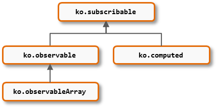

Occasionally, you may find opportunities to streamline your code by attaching new functionality to Knockout's core value types. You can define custom functions on any of the following types:

Because of inheritance, if you attach a function to `ko.subscribable`, it will be available on all the others too. If you attach a function to `ko.observable`, it will be inherited by `ko.observableArray` but not by `ko.computed`.

To attach a custom function, add it to one of the following extensibility points:

 * `ko.subscribable.fn`
 * `ko.observable.fn`
 * `ko.observableArray.fn`
 * `ko.computed.fn`

Then, your custom function will become available on all values of that type created from that point onwards.

***Note:*** It's best to use this extensibility point only for custom functions that are truly applicable in a wide range of scenarios. You don't need to add a custom function to these namespaces if you're only planning to use it once. 

### Example: A filtered view of an observable array

Here's a way to define a `filterByProperty` function that will become available on all subsequently-created `ko.observableArray` instances:

    ko.observableArray.fn.filterByProperty = function(propName, matchValue) {
        return ko.computed(function() {
            var allItems = this(), matchingItems = [];
            for (var i = 0; i < allItems.length; i++) {
                var current = allItems[i];
                if (ko.unwrap(current[propName]) === matchValue)
                    matchingItems.push(current);
            }
            return matchingItems;
        }, this);
    }

This returns a new `ko.computed` value that provides a filtered view of the array, while leaving the original array unchanged. Because the filtered array is a `ko.computed`, it will be re-evaluated automatically whenever the underlying array changes.

The following live example shows how you could use this:


<h3>All tasks ( )</h3>
<ul data-bind="foreach: tasks">
    <li>
        <label>
            <input type="checkbox" data-bind="checked: done" />
             
        </label>
    </li>
</ul>

<h3>Done tasks ( )</h3>
<ul data-bind="foreach: doneTasks">
    <li data-bind="text: title"></li>
</ul>



function Task(title, done) {
    this.title = ko.observable(title);
    this.done = ko.observable(done);
}

function AppViewModel() {
    this.tasks = ko.observableArray([
        new Task('Find new desktop background', true),
        new Task('Put shiny stickers on laptop', false),
        new Task('Request more reggae music in the office', true)
    ]);

    // Here's where we use the custom function
    this.doneTasks = this.tasks.filterByProperty("done", true);
}

ko.applyBindings(new AppViewModel());




#### It's not mandatory

If you tend to filter observable arrays a lot, adding a `filterByProperty` globally to all observable arrays might make your code tidier. But if you only need to filter occasionally, you could instead choose *not* to attach to `ko.observableArray.fn`, and instead just construct `doneTasks` by hand as follows:

    this.doneTasks = ko.computed(function() {
        var all = this.tasks(), done = [];
        for (var i = 0; i < all.length; i++)
            if (all[i].done())
                done.push(all[i]);
        return done;
    }, this);