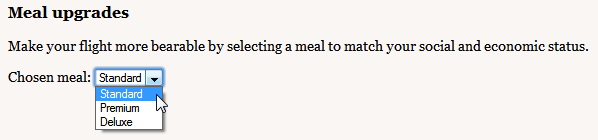
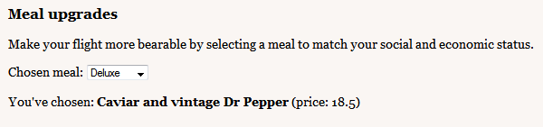
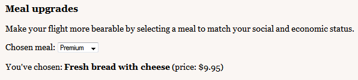

Knockout is a JavaScript library that helps you to create rich, responsive display and editor user interfaces with a clean underlying data model. Any time you have sections of UI that update dynamically (e.g., changing depending on the user's actions or when an external data source changes), KO can help you implement it more simply and maintainably.

Headline features:

* **Elegant dependency tracking** - automatically updates the right parts of your UI whenever your data model changes
* **Declarative bindings** - a simple and obvious way to connect parts of your UI to your data model
* **Flexible and sophisticated templating** - construct a complex dynamic UI easily using arbitrarily nested templates
* **Trivially extensible** - implement custom behaviors as new declarative bindings for easy reuse in just a few lines of code

Additional benefits:

* **Pure JavaScript library** - works with any server or client-side technology
* **Can be added on top of your existing web application** without requiring major architectural changes
* **Compact** - around 25kb *before* gzipping
* **Works on any mainstream browser** (IE 6+, Firefox 2+, Chrome, Safari, others)
* **Comprehensive suite of specifications** (developed BDD-style) means its correct functioning can easily be verified on new browsers and platforms

Developers who've used Silverlight or WPF may recognize KO as an example of the MVVM pattern; developers more familiar with Ruby on Rails or other MVC technologies may see it as a real-time form of MVC with declarative syntax. In another sense, you can think of KO as a general way to make UIs for editing JSON data... whatever works for you :)

## OK, how do you use it?
In short: define your data as a JavaScript model object, and then bind DOM elements and/or templates to it.

### Let's see an example
Consider a screen on which airline passengers can choose to purchase premium meal upgrades for their flight. We want to let them choose a meal, then dynamically show its description and price. First let's declare the available meals:

	var availableMeals = [        	
		{ mealName: 'Standard', description: 'Dry crusts of bread', extraCost: 0 },
		{ mealName: 'Premium', description: 'Fresh bread with cheese', extraCost: 9.95 },
		{ mealName: 'Deluxe', description: 'Caviar and vintage Dr Pepper', extraCost: 18.50 },
	];

If we want to display these options in the UI, we can bind a drop-down list (i.e., an HTML `<select>` element) to it. For example,
	
    <h3>Meal upgrades</h3>
    
Make your flight more bearable by selecting a meal to match your social and economic status.

    Chosen meal: <select data-bind="options: availableMeals, 
    							    optionsText: 'mealName'"></select>
	
This will render as follows:
    							    

### Responding to selections

Next, define a simple data model to describe which item they've chosen:

    var viewModel = { 
    	chosenMeal: ko.observable(availableMeals[0])
    };

Huh? What's `ko.observable`? It's a fundamental concept in KO. It's value that the UI can 'observe' and respond to changes on. Here, we're saying that the UI can observe a value representing the chosen meal, and that initially, it's set to the first `availableMeal` entry (i.e., the 'Standard' meal).

Let's link `chosenMeal` to the drop-down list in the UI. Just update the `data-bind` attribute on the `<select>` element to say the element's `value` should read and write the `chosenMeal` model property:
	
    Chosen meal: <select data-bind="options: availableMeals, 
							    	optionsText: 'mealName',
							    	value: chosenMeal"></select>
	
Technically that's now reading and writing the `chosenMeal` property, but we can't see it doing anything until we add more UI. Let's display the description and price of the chosen meal:

	

		You've chosen: 
		<b data-bind="text: chosenMeal().description"></b>
		(price: )
	

This bit of the UI will now update dynamically as the user chooses different items from the drop-down list:

### More about observables and dependency tracking

One last thing: it would be nicer to format the price as a currency value. Just define a JavaScript function to do that...

	function formatPrice(price) {
		return price == 0 ? "Free" : "$" + price.toFixed(2);
	}

... and then update the binding to use it ...

	(price: )

... and our UI will be a little prettier:

The price formatting shows that you can write arbitrary JavaScript in your bindings, and KO is still able to detect what observables your bindings depend on. That's how it knows what parts of the UI to update when your model changes. It doesn't re-render the entire UI all the time - just the parts whose dependencies have changed.

It's possible to create nested chains of observables computed from other observables (e.g., a total value defined as a sum of prices multiplied by a quantities). When anything in the chain changes, the dependencies further down from there are re-evaluated, and all associated UI updated. You don't have to declare associations between observables explicitly; the framework infers them from the code execution at runtime. 

You can learn more about [observables](observables.html) and [observable arrays](observableArrays.html). The previous example was simple and didn't cover a lot of what makes KO effective. You can learn more about other built-in bindings and [templating](binding-template.html).

## Is KO intended to compete with jQuery (or Prototype, etc.) or work with it?

Everyone loves jQuery! It's an outstanding replacement for the clunky, inconsistent DOM API we had to put up with in the past. jQuery is an excellent low-level way to manipulate elements and event handlers in a web page. I certainly still use jQuery for low-level DOM manipulation. KO solves a different problem.

As soon as your UI gets nontrivial and has a few overlapping behaviors, things can get tricky and expensive to maintain if you only use jQuery. Consider an example: you're displaying a list of items, stating the number of items in that list, and want to enable an 'Add' button only when there are fewer than 5 items. jQuery doesn't have a concept of an underlying data model, so to get the number of items you have to infer it from the number of TRs in a table or the number of DIVs with a certain CSS class. Maybe the number of items is displayed in some SPAN, and you have to remember to update that SPAN's text when the user adds an item. You also must remember to disable the 'Add' button when the number of TRs is 5. Later, you're asked also to implement a 'Delete' button and you have to figure out which DOM elements to change whenever it's clicked. 

### How is Knockout different?
It's much easier with KO. It lets you scale up in complexity without fear of introducing inconsistencies. Just represent your items as a JavaScript array, and then use a template to transform this array into a TABLE or set of DIVs. Whenever the array changes, the UI changes to match (you don't have to figure out how to inject new TRs or where to inject them). The rest of the UI stays in sync. For example, you can declaratively bind a SPAN to display the number of items as follows (and this can go anywhere in your page, not just in a template):

    There are  items

That's it! You don't have to write code to update it; it updates on its own when the `myItems` array changes. Similarly, to make the 'Add' button enable or disable depending on the number of items, just write:

    <button data-bind="enable: myItems().count < 5">Add</button>
    
Later, when you're asked to implement the 'Delete' functionality, you don't have to figure out what bits of the UI it has to interact with; you just make it alter the underlying data model.

To summarise: KO doesn't compete with jQuery or similar DOM APIs. KO provides an alternative, high-level way to link a data model to a UI. KO itself doesn't depend on jQuery, but you can certainly use jQuery at the same time, and indeed that's often useful if you want things like animated transitions.